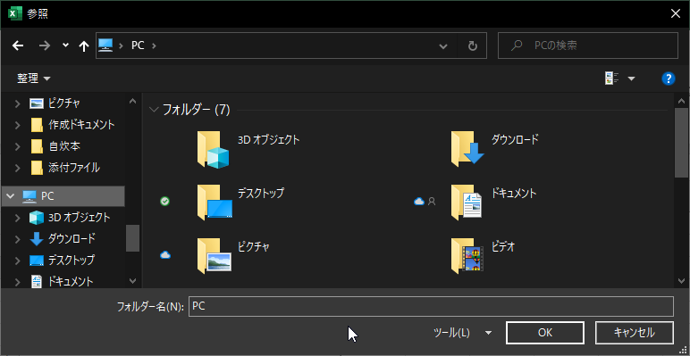

## CSV集約マクロの解説

### はじめに

前節で作成したプログラムのポイントを解説していきます。  
解説されていない場所やその他の疑問などがあればコメント欄やTeamsで質問頂ければ回答します。  

少し自分でもマクロを書いたことある方以上を対象にしています。

### CSVファイルの簡単な説明

CSVは`Comma-Separated Values`の略で、その名の通りコンマで区切られて値が羅列されているというフォーマットです。  
よく勘違いされがちですが、Excel専用ファイルというわけではありません。Excelでも開けると言うだけで、実際にはただのテキストファイルなのでメモ帳でも開けます。

構成がシンプルなため、PCで作成されるだけではなく、設備機械や計測機器などのデバイスからデータを出力する際にもよく使用されます。  
また、大量のデータを扱う様々なアプリがCSVからのインポート、エクスポートに対応している場合が多いために、一種の共通フォーマット的なファイルとして扱われることもあります。

ExcelでCSVファイルを開いた場合、シートが1枚でシート名がCSVファイル名になっているブックとして扱われます。

## プログラム解説

### 定数定義

```vb
'このマクロの設定用シート名
Const SETTING_SHEET = "CSV抽出マクロ"
'CSVをコピーする範囲(固定の場合)
Const STATIC_COPY_RANGE = "B2:C21"
'処理対象にするファイル名のパターン
Const FILENAME_FILTER = "DeviceLog_####01.csv"
```
ここでは3つの定数を定義しています。  
定数とは、プログラム中で使う値に名前をつける作業のことです。  
`Const`が定数を定義する命令で、その後につけたい名前と値を=で結んで記述します。

今回は
- このマクロの設定用シート名
- CSVをコピーする範囲
- 処理する対象となるCSVのファイル名パターン

の3つを定数として定義しています。  

### CSV格納先フォルダ設定ボタンの処理

```vb
Public Function GetTargetFolderPath(RowNumber As Long, ColumnNumber As Long)
    With Application.FileDialog(msoFileDialogFolderPicker)
        If .Show = True Then
            ThisWorkbook.Sheets(SETTING_SHEET).Cells(RowNumber, ColumnNumber).Value = .SelectedItems(1)
        Else
            ThisWorkbook.Sheets(SETTING_SHEET).Cells(RowNumber, ColumnNumber).Value = ""
        End If
    End With
End Function
```

簡単にいうと、この関数`GetTargetFolderPath()`のカッコ内にセルを指定して呼ぶとフォルダオープンダイアログボックスが開き、そこで選択されたフォルダへのパスが指定されたセルに記入されます。  

たとえば
`GetTargetFolderPath(1,2)`とすると1列2行目、つまりA2セルに選択結果が表示されます。

ちなみに、フォルダオープンダイアログボックスというのは下図のようなフォルダ選択画面のことです。  
  


なお、この関数内で実際にダイアログボックスを開いているのは
```vb
Application.FileDialog(msoFileDialogFolderPicker)
```
の部分ですが、このカッコ内の設定値を変更することでフォルダではなくファイルを開いたり、ファイル保存用のダイアログボックスを開いたりすることも可能です。  

| 設定値   | 説明       |
| ------------------------- | ---------------------------------------- |
| msoFileDialogFilePicker   | ユーザーがファイルを選択できます。       |
| msoFileDialogFolderPicker | ユーザーがフォルダーを選択できます。     |
| msoFileDialogOpen         | ユーザーがファイルを開くことができます。 |
| msoFileDialogSaveAs       | ユーザーがファイルを保存できます。       |

### 指定されたフォルダ内のファイルを全て調べる

メイン処理`Public Function MainProccess()`内の処理に入っていきます。  

```vb
    'ファイルオープンダイアログを開いてフォルダ情報を取得する準備
    Dim objFSO As Object, objFolder As Object
    Set objFSO = CreateObject("Scripting.FileSystemObject")
    
    '指定されたフォルダを掴む
    Set objFolder = objFSO.Getfolder(ThisWorkbook.Sheets(SETTING_SHEET).Cells(2, 2).Value)
```

ユーザーが指定されたフォルダの中にあるCSVを全てチェックするためには、まずそのフォルダ内に含まれるファイルの一覧を取得する必要があります。  

そのために、`FileSystemObject`(ファイルシステムオブジェクト)という仕組みを使います。  

```text
ファイルシステムオブジェクトとは

ファイルシステムオブジェクトとは、「ファイルやフォルダに関する様々な情報取得や、ファイル操作ができる便利なツールのカタマリ」くらいに考えておいてください。  

これを使うことで下記のようなことができます。  
- ファイル・フォルダの作成・移動・削除など
- ファイル・フォルダが存在するかどうかの確認
- ファイル・フォルダの場所取得
- ファイルオブジェクト・フォルダオブジェクトの取得
```

まず下記の行でカラのオブジェクトを2つ作ります。  
カラのオブジェクトとは、前述の例でいうと便利なツールがまだ入っていないカラの箱のようなものです。  

  
この時点では箱だけが存在していますが、中身が無いので何にも使うことができません。  

```vb
    Dim objFSO As Object, objFolder As Object
```
1つめのオブジェクト`objFSO`をファイルシステムオブジェクトに変更します。  

```vb
    Set objFSO = CreateObject("Scripting.FileSystemObject")
```
これで箱の中にツール群が格納されて、ファイルシステムオブジェクトとして扱えるようになりました。  
  

  
このツール`objFSO`を使って、今度は`フォルダオブジェクト`という、指定したフォルダの情報取得ができるオブジェクトを作成します。  

```vb
    '指定されたフォルダを掴む
    Set objFolder = objFSO.Getfolder(ThisWorkbook.Sheets(SETTING_SHEET).Cells(2, 2).Value)
```
`.GetFolder()`のカッコ内に情報を取得したいフォルダのパスを指定すると、そのフォルダについての情報取得や操作ができるフォルダオブジェクトが作成されますので、それを`objFolder`に格納します。  

```vb
    For Each CurrentFile In objFolder.Files
```
～中略
```vb
    Next
```

先程のフォルダオブジェクト作成によって、objFolder.Files の中にフォルダ内に含まれるファイルのリストが作成されます。  

この`For Each ～ Next`構文でそれらのファイル全てをチェック対象としています。  

なお、ここで紹介した`FileSystemObject`で何ができるのかについては下記の外部サイトがわかりやすくまとめてありますので参考にしてください。

[Office Tanaka](http://officetanaka.net/excel/vba/filesystemobject/filesystemobject.htm)


### Like演算子

VBAにはLike演算子という便利な比較演算子があります。  

```vb
        If CurrentFile.Name Like FILENAME_FILTER Then
```

ここでは指定フォルダ内に含まれるファイルのファイル名(CurrentFile.Name)を1つづつチェックして、特定パターンのファイル名であるかどうかを確認しています。  

`Like演算子`はあいまいなパターンでの比較ができる演算子です。  

ここではFILENAME_FILTERと比較していますが、FILENAME_FILTERはプログラムの先頭で
```VB
'処理対象にするファイル名のパターン
Const FILENAME_FILTER = "DeviceLog_####01.csv"
```
と定数定義していたので、つまりファイル名が`DeviceLog_####01.csv`と一致しているかどうかを確認しています。  

Like演算子の比較文では文字の中に下記のワイルドカードを使うことができます。  

|文字パターン|引数stringの中の一致する文字|
| ------------------------- | ---------------------------------------- |
|?|任意の1文字|
|*|任意の数の文字|
|#|任意の1文字の数字(0-9)|
|[charlist]|文字リストcharlistに指定した文字の中の任意の1文字|
|[!charlist]|文字リストcharlistに指定した文字以外の任意の1文字|

結局のところ、ファイル名が  
`DeviceLog_`で始まり  
その次に4桁の数値を持ち  
最後は`01.csv`で終わるファイルが処理の対象となります。